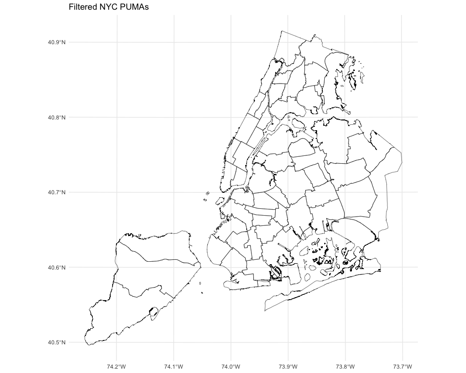
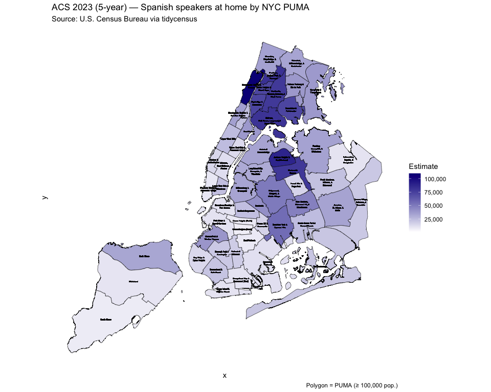
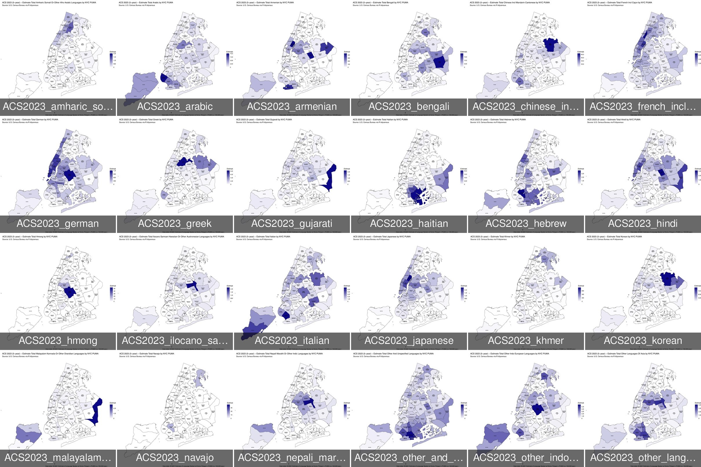
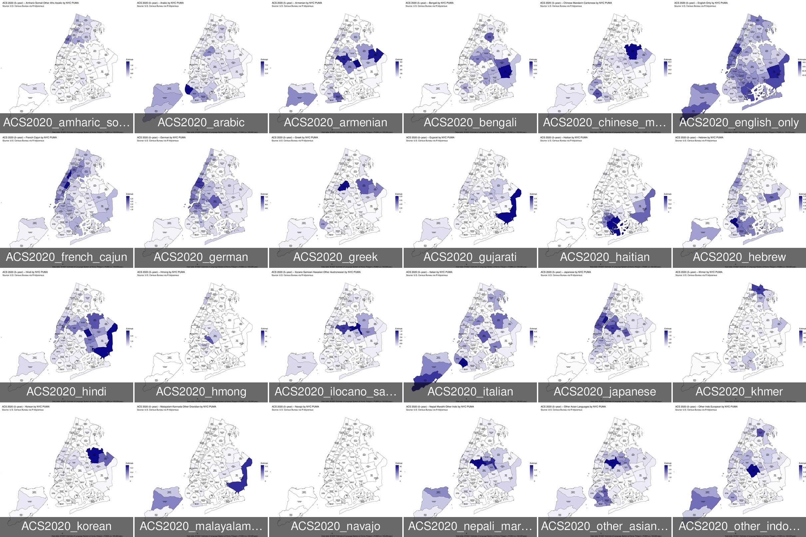
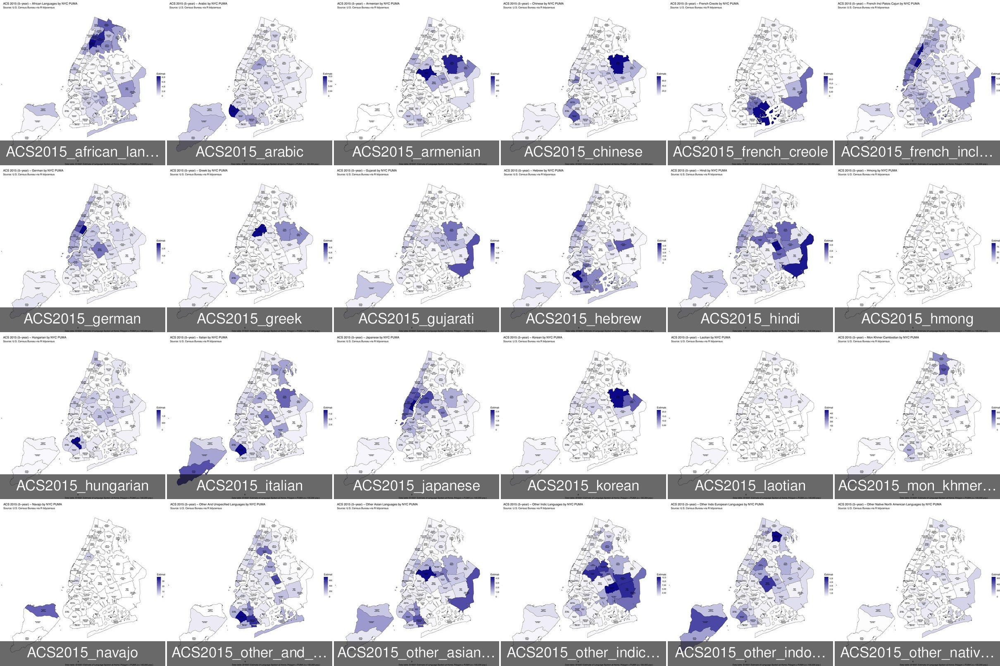
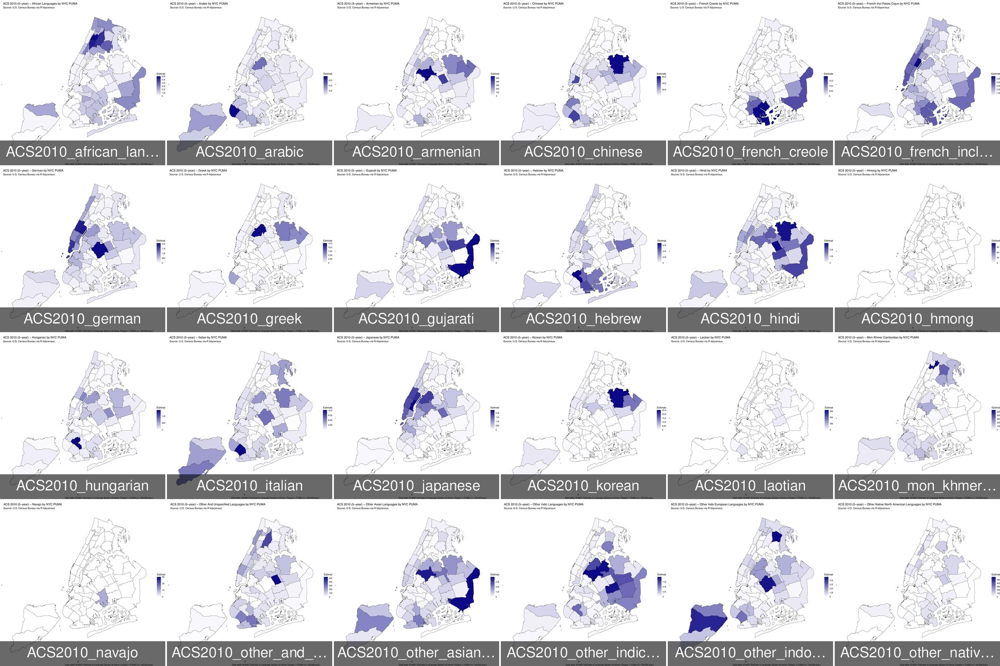

RProcedureLanguagesInNYC2024
================
Tomonori Nagano
2025-12-03

# NYC Neighborhood (NTA) Language Maps with ACS Data
## 0. Package setup

## 1. Configuration
``` r
# ACS settings
acs_year   <- 2023
acs_survey <- "acs5" # acs5 (American Community Survey 5 years) is valid only after 2009. acs1 is available from 2005

# NYC counties
nyc_counties <- c("New York", "Kings", "Queens", "Bronx", "Richmond")

# b16001_vars: data frame with columns name, label, concept, geography
# e.g. b16001_vars <- load_variables(2022, "acs5", "B16001")
vars_acs <- load_variables(acs_year, acs_survey, cache = TRUE)
make_clean_name <- function(x) {
  x %>%
    str_to_lower() %>%
    str_replace_all("[^a-z0-9]+", "_") %>%  # non-alnum → _
    str_replace_all("_+", "_") %>%          # collapse multiple _
    str_replace("^_|_$", "")                # trim leading/trailing _
}

lang_df <- vars_acs %>%
  # keep only B16001_* variables
  filter(str_starts(name, "B16001_")) %>%
  # keep only Estimate!!Total!!<language> (exactly 2 "!!")
  filter(str_detect(label, "^Estimate!!Total:?!!"),
         str_count(label, "!!") == 2) %>%
  # drop the grand total row if present (B16001_001)
  filter(name != "B16001_001") %>%
  mutate(
    language   = str_remove(label, "^Estimate!!Total!!"),
    clean_name = make_clean_name(language)
  )

# Named vector: clean_name -> ACS variable code
lang_vars_total <- setNames(lang_df$name, lang_df$clean_name)
lang_vars_total```

## 2. Get NYC Neighborhood Tabulation Areas (NTAs)

``` r
## Alternative: Load NYC‑only PUMA shapefile you downloaded
## Replace with your actual path to the unzipped shapefile.
## https://www.nyc.gov/content/planning/pages/resources/datasets/public-use-microdata-areas
if (acs_year < 2023) {
  nyc_pumas <- st_read("nypuma2010_25d/nypuma2010.shp")
} else {
  nyc_pumas <- st_read("nypuma2020_25d/nypuma2020.shp")
}
```

    ## Reading layer `nypuma2020' from data source `/Users/tnagano/Desktop/nypuma2020_25d/nypuma2020.shp' using driver `ESRI Shapefile'
    ## Simple feature collection with 55 features and 3 fields
    ## Geometry type: MULTIPOLYGON
    ## Dimension:     XY
    ## Bounding box:  xmin: 913175.1 ymin: 120128.4 xmax: 1067383 ymax: 272844.3
    ## Projected CRS: NAD83 / New York Long Island (ftUS)

``` r
# NYC data does not have GEOID, which is required to map the census data
nyc_pumas <- nyc_pumas %>%
  mutate(
    # Ensure PUMAID is 5-digit string (pad with leading zeros if needed)
    PUMA5 = sprintf("%05s", PUMA),
    # Prepend state FIPS for New York ("36"), then form GEOID
    GEOID = paste0("36", PUMA5)
  )

## The shape file is available at TIGRIS, but it does not show the water boundaries  
## 1) Download NY State PUMAs (cartographic boundary for simpler polygons)
#ny_pumas <- pumas(state = "NY", cb = TRUE, year = 2020)
#
## 2) Inspect names to confirm column holding GEOID
#names(ny_pumas)
## Commonly you’ll see GEOID20; verify if available
#
## 3) Filter to NYC PUMAs. 
## A simple approach: filter by the county names in NYC (New York, Kings, Queens, Bronx, Richmond)
## Hydrography for NYC counties
#hydro <- purrr::map_df(
#  c("New York","Kings","Queens","Bronx","Richmond"),
#  ~ tigris::area_water(state = "NY", county = ., year = 2023)
#)
#nyc_pumas <- ny_pumas %>%
#  filter(grepl("NYC-", NAMELSAD20))

ggplot(nyc_pumas) +
  geom_sf(fill = NA, color = "black") +
  labs(title = "Filtered NYC PUMAs") +
  theme_minimal()
```



## 3. Get ACS language data by census tract for NYC

``` r
message("Downloading ACS language data for NYC tracts...")
# Optional: inspect available ACS variables (do once and comment out later)
# vars_acs <- load_variables(acs_year, acs_survey, cache = TRUE)
# head(vars_acs)
# View(vars_acs)   # then search for B16001 variables
acs_puma <- tidycensus::get_acs(
  geography = "puma",
  state = "NY",
  variables = lang_vars_total,
  year = acs_year,
  survey = acs_survey,
  geometry = FALSE        # we’ll join to shapefile ourselves
)

# quick sanity check
table(nchar(acs_puma$GEOID))   # should all be 7
```

    ## 
    ##    7 
    ## 6192

``` r
head(acs_puma)
```

    ## # A tibble: 6 × 5
    ##   GEOID   NAME                               variable     estimate   moe
    ##   <chr>   <chr>                              <chr>           <dbl> <dbl>
    ## 1 3600100 St. Lawrence County PUMA; New York english_only    95357   999
    ## 2 3600100 St. Lawrence County PUMA; New York spanish          1358   206
    ## 3 3600100 St. Lawrence County PUMA; New York french_cajun      565   179
    ## 4 3600100 St. Lawrence County PUMA; New York haitian            91    69
    ## 5 3600100 St. Lawrence County PUMA; New York italian           243   117
    ## 6 3600100 St. Lawrence County PUMA; New York portuguese         43    48

## 4. Join ACS data with PUMA shapefile

``` r
# Ensure the GEOID matches between ACS and shapefile; usually both have padded codes
map_data <- nyc_pumas %>%
#  left_join(acs_puma, by = c("GEOID20" = "GEOID"))
  right_join(acs_puma, by = c("GEOID"))

# check for missing estimates after join
table(is.na(map_data$estimate))
```

    ## 
    ## FALSE 
    ##  6192

``` r
# Check for unmatched PUMAs:
missing <- filter(map_data, is.na(estimate))
if (nrow(missing) > 0) {
  warning("Some PUMAs have no ACS data — check GEOIDs / table availability.")
}
```

## 5. Plot choropleth map

``` r
message("Creating choropleth map for Spanish speakers at home...")

map_data <- map_data %>%
  mutate(label = str_extract(NAME, "(?<=--).*?(?= PUMA)") |> str_trim(),
         label = str_replace(label, " & ", " &\n"),
         label = str_replace(label, ",", ",\n"))

# Obtain the centroids for the label placement          
nyc_map_centroids <- st_centroid(map_data)
```

    ## Warning: st_centroid assumes attributes are constant over geometries

``` r
# Color pallets
white_viridis <- colorRampPalette(c("white", viridisLite::plasma(1)))

# Creating an example map (Spanish only)
map_spanish <- map_data %>%
  filter(variable == "spanish")  # ← language name, not code

ggplot(map_spanish) +
  geom_sf(aes(fill = estimate), color = "black", size = 0.1) +
  geom_sf_text(data = nyc_map_centroids, aes(label = label), size = 1) +
  scale_fill_gradientn(colours  = white_viridis(50), name = "Estimate", labels = scales::comma, na.value = "grey90") +
  labs(
    title    = paste0("ACS ", acs_year, " (5-year) — Spanish speakers at home by NYC PUMA"),
    subtitle = "Source: U.S. Census Bureau via tidycensus",
    caption  = "Polygon = PUMA (≥ 100,000 pop.)"
  ) +
  theme_minimal() +
  theme(panel.grid = element_blank(), axis.text  = element_blank(), axis.ticks = element_blank())
```



``` r
# create a lookup table so we can generate nicer titles

# create a lookup table so we can generate nicer titles
lang_lookup <- tibble(
  lang_key = names(lang_vars_total),             # "spanish", "japanese", ...
  var_code = as.character(lang_vars_total)       # "B16001_003", ...
) %>%
  mutate(
    # nicer labels for titles
    lang_label = str_replace_all(lang_key, "_", " ") |> str_to_title()
  )

# Output directory
out_dir <- "output"
if (!dir.exists(out_dir)) dir.create(out_dir, recursive = TRUE)

# function that makes and saves ONE map for a given language key
make_lang_map <- function(lang_key_in) {   # <— use lang_key_in as the argument

  # look up pretty label etc. in your lookup table
  this_row <- lang_lookup %>% 
    dplyr::filter(lang_key == lang_key_in)

  this_lang <- this_row$lang_label[1] %||% lang_key_in
  this_key  <- this_row$lang_key[1]   %||% lang_key_in

  # filter to this language (variable column holds the language key)
  df_lang <- map_data %>% 
    dplyr::filter(variable == lang_key_in)

  p <- ggplot(df_lang) +
    geom_sf(aes(fill = estimate), color = "black", size = 0.1) +
    geom_sf_text(data = nyc_map_centroids, aes(label = label), size = 1) +
    scale_fill_gradientn(colours  = white_viridis(50), name = "Estimate", labels   = scales::comma, na.value = "grey90") +
    labs(
      title    = paste0("ACS ", acs_year, " (5-year) — ", this_lang, " by NYC PUMA"),
      subtitle = "Source: U.S. Census Bureau via R tidycensus",
      caption  = "Data table: B16001 Estimate of Language Spoken at Home; Polygon = PUMA (≥ 100,000 pop.)"
    ) +
    theme_minimal() +
    theme(panel.grid  = element_blank(), axis.text   = element_blank(), axis.ticks  = element_blank())
  out_file <- paste0("output/LanguagesInNYC2025_ACS", acs_year, "_", this_key, ".pdf")
  ggsave(out_file, plot = p, width = 12, height = 10, dpi = 300)
}

# run for ALL languages in lang_vars_total
purrr::walk(names(lang_vars_total), make_lang_map)
```

- See "docs" for the pdf outputs for 2023, 2020, 2015, and 2010 (the oldest ACS 5-years is 2009).

## 2023



## 2020



## 2015



## 2010



